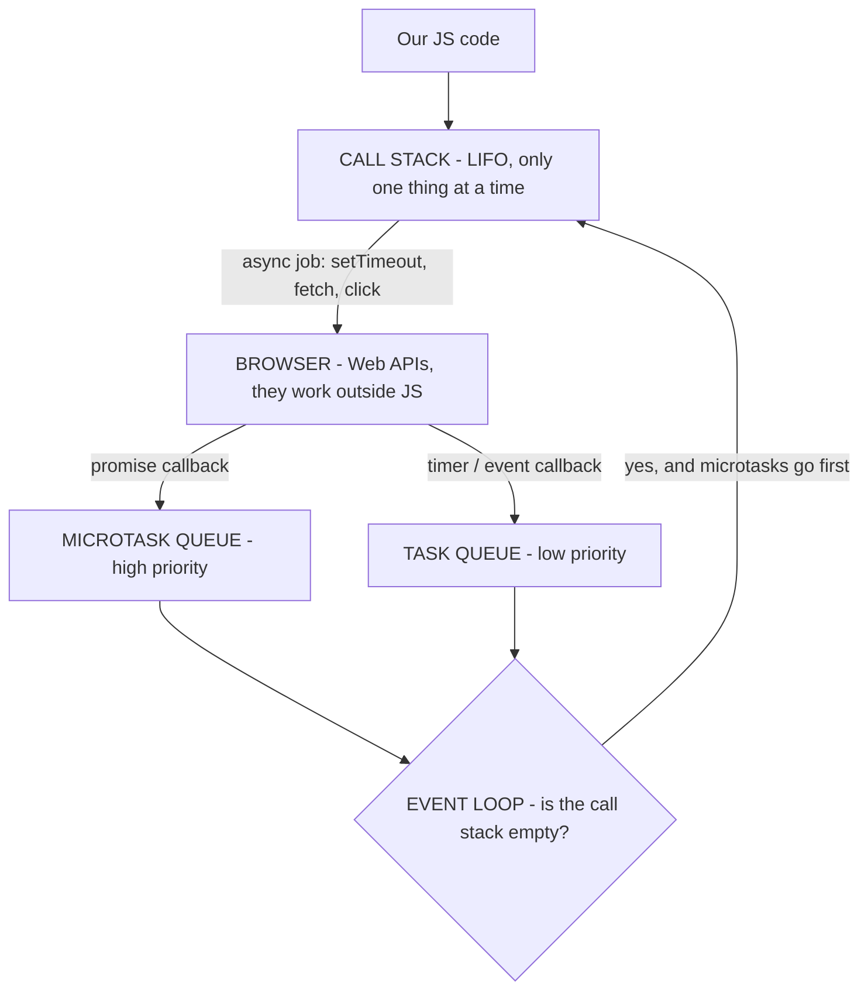
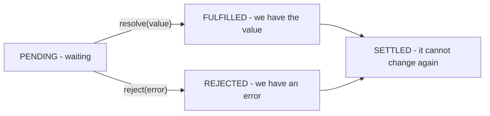

# JavaScript

The runtime, scope and closures, prototypes, async and error handling.

The class side of the language — `this`, the four pillars, inheritance, composition — is in [[TypeScript#2. OOP in JavaScript and TypeScript]]. Array methods are in [[Arrays]].

---

# 1. Runtime and the event loop

## Call stack

The call stack has the job of executing the code of our JS application.

It is **LIFO** (Last In, First Out): the last function that enters is the first one that goes out.

It receives the JS tasks, like a `console.log` or normal JS code. The event loop sends things to the call stack from the microtask queue and the task queue. The microtask queue has more priority than the task queue.

## Task queue (macrotasks)

A special queue used to handle callbacks from browser APIs: `setTimeout`, `setInterval`, `setImmediate`, I/O, and DOM events (`click`, `scroll`, `keypress`, `mousedown`). When the API is finished, that callback goes to the task queue.

Also called the *macrotask queue* or *callback queue*.

> [!warning] `fetch` does NOT go here
> `fetch` returns a **promise**, so its `.then()` callback goes to the **microtask queue**. This is a very common interview question and an easy one to get backwards under pressure.

## Microtask queue

A special queue for promises (`.then`, `.catch`, `.finally`), the body after an `await`, `queueMicrotask` and `MutationObserver`.

It has **more priority** than the task queue.

## The event loop

The piece of the mechanism that takes tasks from the two queues and passes them to the call stack. The loop has **four** steps, not three:

1. Take **one** task (macrotask) and run it to the end.
2. Drain the **whole** microtask queue — including microtasks created while draining.
3. **Update the rendering**: `requestAnimationFrame` → recalculate style → layout → paint. About every 16.7 ms at 60 Hz, and skipped if nothing changed.
4. Repeat.

**Rendering is a step of the loop.** It is not something the browser does in parallel somewhere else. Saying that is the single highest-value sentence in this whole section.

Two more rules:

1. It only passes a task **when the call stack is empty**.
2. It empties the **whole** microtask queue first, and only then it takes **one** task from the task queue.

```js
console.log("1");                          // call stack, now
setTimeout(() => console.log("2"), 0);     // task queue
Promise.resolve().then(() => console.log("3")); // microtask queue
console.log("4");                          // call stack, now

// Output: 1, 4, 3, 2
```

## Everything together: how JS runs the code

The important idea: **JavaScript is single-threaded**. It has only **one** call stack, so it can only do **one thing at a time**. The queues and the event loop are the way the browser lets JS do asynchronous things **without blocking** that single thread.



### The complete cycle

1. JS reads the code line by line and puts every function in the **call stack**.
2. If the function is **synchronous**, it runs, returns, and leaves the stack.
3. If it is **asynchronous** (`setTimeout`, `fetch`, a click listener), JS does **not** wait. It gives the job to the **browser** and continues with the next line. This is why the page does not freeze.
4. When the browser finishes that job, it does **not** put the callback in the call stack directly. It puts it in a **queue**:
	- promise callback → **microtask queue**
	- timer, DOM event, geolocation → **task queue**
5. The **event loop** watches the call stack. When the stack is **empty**:
	- first it runs **all** the microtasks, one by one, until the microtask queue is empty,
	- then it takes **only one** task from the task queue,
	- then it updates the rendering,
	- and it repeats.
6. This is why a promise always runs before a `setTimeout`, even with `0` ms.

### Example step by step

```js
console.log("Start");

setTimeout(() => console.log("Timeout"), 0);

Promise.resolve().then(() => console.log("Promise"));

console.log("End");

// Output: Start, End, Promise, Timeout
```

| # | What happens | Where | Output |
|---|---|---|---|
| 1 | `console.log("Start")` enters, prints, leaves | Call stack | `Start` |
| 2 | `setTimeout` enters, gives the timer to the browser, leaves | Call stack → Browser | |
| 3 | The promise is already resolved, so its callback waits | Microtask queue | |
| 4 | `console.log("End")` enters, prints, leaves | Call stack | `End` |
| 5 | The main code finishes, **the call stack is empty** | — | |
| 6 | Event loop: microtasks **first** | Microtask queue → Call stack | `Promise` |
| 7 | Microtasks empty, now **one** task | Task queue → Call stack | `Timeout` |

> [!tip] Why `0` ms is not really 0
> `setTimeout(fn, 0)` does not mean "run now". It means "put this in the task queue as soon as possible". It still has to wait for the call stack to be empty **and** for all the microtasks to finish.

> [!question] Short answer for the interview
> "Rendering is a step of the event loop, not something in parallel. JavaScript is single-threaded with one call stack, so when there is an async operation the browser handles it outside of JS. Each turn of the loop: one task, then the whole microtask queue drained, then style, layout and paint. Promise reactions are microtasks, so they always run before a `setTimeout(0)`, and they all run before the next paint."

## The page is frozen and a pure-CSS spinner has stopped. The stack is empty most of the time. What is happening?

**Microtask starvation.** A microtask queues another microtask, so step 2 never finishes:

- The loop never reaches step 3 → no paint → **the CSS animation freezes**, because its frames are computed on the main thread.
- The loop never returns to step 1 → click and scroll stay in the task queue → **no input**.
- The stack looks empty because each microtask is tiny. **Memory stays flat.** Fingerprint: **100% CPU, normal memory** — starvation, not a leak.

```js
let n = 0;
setTimeout(() => console.log("timer fired, after n =", n), 0);
function loop() {
  n++;
  if (n < 100000) Promise.resolve().then(loop);   // microtask queues microtask
}
loop();
console.log("sync end, n =", n);
// sync end, n = 1
// timer fired, after n = 100000   ← the timer waited for ALL the microtasks
```

The same recursion with `setTimeout` does **not** starve — every timer is a separate task, so the loop breathes and paints between them.

| Recursion | Queue | Result |
|---|---|---|
| `setTimeout(loop, 0)` | task | Loop still reaches step 3 → page paints, spinner moves, CPU burns |
| `Promise.resolve().then(loop)` | **microtask** | Step 3 never arrives → page completely dead |

**Detection**: Performance tab → a long block with **no Frame markers and no Paint entries**. A normal long task is one big yellow block; starvation is many small ones with nothing between.

> [!tip] The follow-up they always ask
> *"Would a spinner using `transform: rotate()` also freeze?"* → Often **no**. `transform`, `opacity` and `filter` can be animated on the **compositor thread**, so they keep moving while the main thread is dead. Anything that needs layout (`width`, `left`, `top`, `margin`) freezes. This single fact proves you know which thread does what. More in [[Browser Platform]].

## The event loop in Node.js

Node's loop is libuv's, with **phases** instead of one task queue: timers → pending callbacks → poll (I/O) → check (`setImmediate`) → close callbacks. Microtasks drain between every phase, and `process.nextTick` has its own queue that drains **before** promise microtasks.

```js
setTimeout(() => console.log('timeout'), 0);
setImmediate(() => console.log('immediate'));
Promise.resolve().then(() => console.log('promise'));
process.nextTick(() => console.log('nextTick'));
// nextTick, promise, timeout, immediate
```

There is no rendering step — that is the browser's step 3 and it does not exist on the server.

---

# 2. Scope, hoisting and closures

## `var`, `let`, `const` and the TDZ

| | Scope | Hoisting | Reassign | Mutate |
|---|---|---|---|---|
| `var` | **function** | hoisted, initialised `undefined` | ✅ | ✅ |
| `let` | **block** | hoisted but in the **TDZ** | ✅ | ✅ |
| `const` | **block** | hoisted but in the **TDZ** | ❌ | ✅ |

`const` blocks **reassignment**, not mutation — so `arr.push(x)` on a `const` array works. Touching a `let`/`const` before its declaration throws `ReferenceError: Cannot access 'x' before initialization` — that is the TDZ, and it is different from `var`, which gives `undefined`.

```js
console.log(a);   // undefined      ← var exists, but it is empty
var a = 1;

console.log(b);   // ReferenceError ← TDZ
let b = 2;
```

> [!question] Short answer for the interview
> "`var` is function scope, `let` and `const` are block scope. `var` can be redeclared and it hoists as `undefined`; `let` and `const` are in the temporal dead zone, so they throw a `ReferenceError` if we use them before. `const` can not be reassigned, but if it is an object we can still mutate its properties."

## Hoisting

When JS analyses the code, before executing it, it **registers** the declarations of the variables and the functions in the memory of that scope. This is why we can use some things before the line where they are written.

- **Function declarations** are hoisted whole — body included — so they are callable before their line.
- **`var`** is hoisted and initialised to `undefined`.
- **`let` / `const` / `class`** are hoisted but stay in the **TDZ** until the declaration runs.
- **Function expressions and arrows assigned to a variable** follow the variable's rules, not the function's.

## What is a closure, at engine level

A closure is **a function plus a live reference to the lexical environment where it was defined**, not where it is called. Privacy is one *use* of it, not the definition.

- Every function holds an internal `[[Environment]]` reference to the **Lexical Environment** of its definition.
- That environment is a **heap-allocated object** holding the bindings.
- When the outer function returns, its environment would normally be garbage — but if an inner function still references it, the environment **survives**.

### Execution context ≠ lexical environment

This is the distinction the whole answer stands on. They are **two different objects, in two different memories, with two different lifetimes**. Saying *"the context is not cleaned up"* is what breaks the answer, because the stack frame is **always** cleaned up.

| | **Execution context** | **Lexical Environment** (V8 calls it a `Context`) |
|---|---|---|
| Created | when the function is **called** | when the inner function is **defined** |
| Lives in | the **stack** | the **heap** |
| Dies | always, on `return` | only when nothing references it |

Step by step, for:

```js
function withClosure() {
  const big = new Array(2e6).fill('x'); // ~16MB
  return () => big.length;
}
const f = withClosure();
```

1. V8 parses the code and **before running it** already knows the arrow captures `big`. So `big` is **not** put in the stack frame — it goes into a `Context` object on the heap.
2. The execution context is created → a frame is pushed on the stack.
3. The arrow function object is created, with `[[Environment]]` pointing at that heap `Context`.
4. `return` → **the stack frame is popped and gone**. Always.
5. But `f` → arrow → `[[Environment]]` → `Context` → `big`. So `big` stays.

```
STACK (dies on return)          HEAP (survives)
┌────────────────────┐          ┌─────────────────┐
│ withClosure frame  │  ✗ pop   │ Context         │
└────────────────────┘          │   big: [16MB]   │
                                └────────▲────────┘
   f (global) ──► arrow fn ─────────────┘
                  [[Environment]]
```

So there is nothing to *clean* on the stack. There is something to **release** on the heap.

V8 normally retains only the variables the closure **actually references** (computed at parse time) — but closures created in the **same scope share one environment object**, and `eval` or `with` in that scope defeats the optimisation entirely.

## Memory leak patterns with closures, and their fixes

### First: the GC counts paths, not scopes

The collector never asks *"has this function finished?"*. It does **mark-and-sweep from the GC roots** — it marks everything reachable and deletes the rest. The roots that matter in the browser:

- the **global / module scope**
- the current **call stack**
- the **DOM tree** (nodes inside `document`)
- the browser's own lists: **active timers, registered listeners, observers, pending promises**

> [!important] The one sentence
> A leak is **an object you will never use again that still has a path from a root**.

Which makes the four patterns below the same bug four times. Only the root changes — and in the interview, **naming the root is the answer**.

| Pattern | The root that was not released |
|---|---|
| 1. Detached node | something still alive points at the node |
| 2. `setInterval` | the browser's timer list holds the callback |
| 3. Subscription | the emitter's subscribers array |
| 4. Shared environment | your own variable holds the whole `Context` |

### 1. Detached DOM node held by a listener

A detached node leaks **only when something alive still points at it**. `node.remove()` on its own is not a leak: the listener is stored on the node, so once nothing references the node, the whole group (node + listener + captured data) is unreachable and the browser collects it.

The two versions that do leak:

```js
const cache = [];                  // ← module scope = a GC root
function mount() {
  const node = document.getElementById('panel');
  const rows = new Array(1e6).fill('data');
  node.addEventListener('click', () => console.log(rows.length));
  cache.push(node);                // ← this is what leaks
  node.remove();
}
```

```js
// the listener sits on something that never goes away
window.addEventListener('resize', () => node.classList.add('x')); // window IS a root
node.remove(); // node stays alive through the closure hanging off window
```

Why the distinction matters: if the answer is *"the detached node stays in memory"* and the follow-up is **"held by what?"**, the root has to be nameable.

Fix: `removeEventListener`, or better an `AbortController`:

```js
const ac = new AbortController();
node.addEventListener('click', handler, { signal: ac.signal });
ac.abort(); // detaches every listener registered with this signal
```

### 2. `setInterval` never cleared

The interval is a GC root; everything the callback closes over lives until `clearInterval`.

### 3. Subscriptions with no unsubscribe

Emitters, stores, websockets. Every `subscribe` needs a teardown (in React, the cleanup returned from `useEffect`).

### 4. Shared lexical environment

Keeping a tiny closure can pin a huge variable used by a sibling closure in the same scope.

```js
function sharedScope() {
  const big = new Array(2e6).fill('x'); // ~16MB
  const small = 42;
  const usesBig   = () => big.length;   // the sibling that does use big
  const usesSmall = () => small;
  return usesSmall;                     // only this one is kept
}
```

Verified in Node ✅ (`--expose-gc`, `global.gc()` twice, 5 closures of ~16MB each):

| Case | Retained |
|---|---|
| the closure does **not** reference `big` | **0.0 MB** |
| the closure references `big` | **76.3 MB** |
| the closure only uses `small`, a **sibling** uses `big` | **76.3 MB** |

Row 1 is the V8 optimisation: `big` is never captured, so it is not in the `Context` at all. Row 3 is this pattern — the small closure retains the same 76 MB as the big one, because `usesBig` and `usesSmall` **share one `Context` object** and `big` is inside it.

Fix: put the big value in its own scope, or `big = null` when it is no longer needed.

**Detection**: DevTools → Memory → **heap snapshot**, take two, use *Comparison*, filter for **`Detached HTMLElement`** and `Closure` retainer chains.

**Names to drop**: `WeakMap`, `WeakRef`, `FinalizationRegistry` — references that do not prevent collection.

> [!question] Short answer for the interview
> "Calling a function creates an execution context on the stack, and that frame always dies on the return. Separately, V8 allocates a `Context` object on the heap holding the variables that some inner function captures — decided at parse time — and the function keeps a reference to it in `[[Environment]]`. So the leak is not that a context 'is not cleaned up': it is that the heap object is still reachable from a GC root — the timer list, an emitter's subscribers, or a variable of mine. The classic ones are a listener on a detached node, an interval never cleared, a subscription without teardown, and closures sharing one environment, so keeping the smallest one can pin the biggest variable. I find them with two heap snapshots in DevTools, comparing and filtering for detached nodes."

---

# 3. Prototypes

The `class` keyword, the four pillars, `this` and inheritance are in [[TypeScript#2. OOP in JavaScript and TypeScript]]. This is the chain itself.

## The prototype chain, step by step

For `dog.speak()`:

1. Own property `speak` on `dog`? No.
2. Follow `dog.[[Prototype]]` (`Object.getPrototypeOf(dog)`, legacy `__proto__`) → `Dog.prototype`. Found? No.
3. Follow `Dog.prototype.[[Prototype]]` → `Animal.prototype`. Found → call it with `this` bound to **`dog`** (the receiver, not the object where the method was found).
4. Otherwise continue → `Object.prototype` → `null`. Chain ends → `undefined` → `TypeError: dog.speak is not a function`.

**Reads walk up, writes land locally.** `dog.speak = fn` creates an **own** property that shadows the prototype's (unless a setter is found on the chain).

`class Dog extends Animal` creates **two** links, not one:

```js
Object.getPrototypeOf(Dog.prototype) === Animal.prototype; // instance methods
Object.getPrototypeOf(Dog)           === Animal;           // STATIC methods — the forgotten one
```

## What `class` gives that ES5 constructors cannot replicate

- **`#private` fields** — enforced by the engine, not a convention. `#x in obj` is the brand check.
- **Correct subclassing of built-ins** (`Array`, `Error`, `Map`) — `super()` allocates the exotic object via `new.target`.
- **Cannot be called without `new`** — `Dog()` throws.
- Methods are **non-enumerable**, so they do not appear in `for...in`.
- Class bindings are **not hoisted** — they sit in the TDZ, like `let`.
- `super.method()` uses `[[HomeObject]]`; the manual `Parent.prototype.method.call(this)` breaks in deeper hierarchies.

---

# 4. Async

## How promises work

A **promise** is an object that represents a value that we do **not** have yet. It is the result of an asynchronous operation that will finish in the future.

### The 3 states



A promise starts as **pending**. When it changes to **fulfilled** or **rejected** we say it is **settled**, and after that it can **never** change again.

### How we create it and how we use it

```js
// create
const myPromise = new Promise((resolve, reject) => {
  const ok = true;
  if (ok) {
    resolve("it worked");   // pending → fulfilled
  } else {
    reject(new Error("it failed"));  // pending → rejected
  }
});

// use it with .then
myPromise
  .then((value) => console.log(value))     // receives the resolve
  .catch((error) => console.log(error))    // receives the reject
  .finally(() => console.log("always runs"));

// use it with async / await (the same, but easier to read)
async function run() {
  try {
    const value = await myPromise;
    console.log(value);
  } catch (error) {
    console.log(error);
  } finally {
    console.log("always runs");
  }
}
```

`async/await` is only **syntactic sugar** over promises. An `async` function **always** returns a promise, and `await` pauses that function until the promise is settled — but it does **not** block the call stack, so the rest of the app keeps working.

> [!info] Connection with the event loop
> The `.then()` callbacks do not run immediately. They go to the microtask queue, and the event loop runs them when the call stack is empty. This is why a promise always runs before a `setTimeout`.

### Chaining

Each `.then()` returns a **new** promise, so we can chain them. This is what solves the old *callback hell*.

```js
fetch("/api/user")
  .then((res) => res.json())      // we return a value → it goes to the next .then
  .then((user) => console.log(user.name))
  .catch((error) => console.log(error));  // catches the error of ANY step above
```

> [!warning] Very common mistake
> If we forget the `return` inside a `.then()`, the next `.then()` receives `undefined`.

> [!question] Short answer for the interview
> "A promise is an object that represents the result of an async operation that is not ready yet. It has 3 states: pending, fulfilled and rejected, and when it settles it cannot change again. We consume it with `.then/.catch/.finally` or with `async/await`, which is sugar over the same thing. Its callbacks go to the microtask queue, so they have priority over `setTimeout`."

## The four combinators

| | Resolves when | Rejects when | Use it for |
|---|---|---|---|
| `all` | **all** fulfil | the **first** rejection (others keep running) | all-or-nothing |
| `allSettled` | **all** settle | never | batches where survivors matter |
| `race` | the **first** to settle, either way | the first rejection if it is first | timeouts |
| `any` | the **first** fulfilment | only if **all** reject (`AggregateError`) | fallbacks / mirrors |

```js
// all: we need the 3 results, if one fails we lose everything
const [user, posts, comments] = await Promise.all([
  fetch("/user"), fetch("/posts"), fetch("/comments")
]);

// allSettled: we want to know what happened with each one
const results = await Promise.allSettled([...]);
// [{ status: "fulfilled", value: ... }, { status: "rejected", reason: ... }]
```

## 200 requests to fire: `Promise.all`, a sequential loop, or batches?

**Batches / a pool of 5–10** — because it **bounds concurrency**, not because it is "flexible".

| Option | The real trade-off |
|---|---|
| `Promise.all` | **Fastest**, but risks 429s and connection-pool exhaustion. Not "too slow" |
| Sequential `for...of` | Makes the **fewest** concurrent requests, not "a lot". Unusably slow: 200 × latency |
| Batched / pool | Bounds concurrency, gives one place for retries, backoff and cancellation |

> [!warning] `Promise.all` rejects fast but does NOT cancel
> When request 137 rejects, the other 199 **keep running to completion**. You just never see their results. Wasted bandwidth, and the side effects still fire. Promises have no cancellation — that is `AbortController`.

**The production failure modes** — this is the half that separates a correct answer from a senior one:

*Client side*
- **HTTP/1.1 caps ~6 connections per origin.** 200 promises start instantly; 194 sit in the browser socket queue. You did not parallelise — you built an invisible queue you cannot control. HTTP/2 multiplexes, which changes but does not remove the limit.
- **Every timeout starts at t = 0.** Request #180 waits for 190 requests' worth of queue time and then times out although the server is healthy → cascading false failures.
- **Memory spike** — 200 in-flight responses buffered at once.
- **No cancellation** — the user navigates away and all 200 keep going.

*Server side*
- **429 rate limiting** — partial success where a pool would get 100%.
- **Thundering herd**, and a naive retry-all doubles the burst.
- Connection-pool / DB exhaustion if each request hits the DB.

**What the pool buys**: bounded memory, bounded in-flight time (so timeouts mean something), one place for retry with **exponential backoff + jitter**, respect for `Retry-After`, and one `AbortController` that kills the whole batch.

```js
async function pool(items, limit, worker) {
  const results = new Array(items.length);
  let cursor = 0;
  const runners = Array.from({ length: Math.min(limit, items.length) }, async () => {
    while (cursor < items.length) {
      const i = cursor++;
      try {
        results[i] = { status: 'fulfilled', value: await worker(items[i], i) };
      } catch (reason) {
        results[i] = { status: 'rejected', reason };
      }
    }
  });
  await Promise.all(runners);
  return results;
}
```

> [!important] The answer that actually reads as senior
> "Before tuning concurrency I would ask why the client makes 200 calls at all. This is an **N+1 over HTTP**. The real fix is a batch endpoint — `GET /items?ids=1,2,3` — or cursor pagination. If I cannot change the backend, then a pool of 5–10 with backoff, jitter and a shared `AbortController`."
>
> **Senior = question the shape of the problem first, then engineer inside the constraint.**

## Why does `try/catch` not catch an error thrown inside `setTimeout`?

```js
try {
  setTimeout(() => { throw new Error('boom'); }, 0);
} catch (e) {
  // never runs
}
```

`setTimeout` **returns immediately**. The `try` block completes and its stack frame is gone. The callback runs later, in a **new macrotask on a fresh, empty call stack** — there is no `catch` above it. It becomes an uncaught exception → `window.onerror` / `process.on('uncaughtException')`.

**`try/catch` catches lexically and synchronously, not temporally.** `await` works precisely because it resumes the *same* function frame:

```js
try { await delay(0).then(() => { throw new Error('boom'); }); } catch (e) { /* caught */ }
```

### Unhandled rejections

- **Browser**: fires `unhandledrejection` on `window` (cancelable with `preventDefault()`), logs, the page keeps running. Hook it to the error tracker.
- **Node ≥ 15**: default is `throw` — it **crashes the process** with `ERR_UNHANDLED_REJECTION`. Correct handling is log + graceful shutdown, not swallow.

```js
process.on('unhandledRejection', (reason) => {
  logger.fatal({ reason }, 'unhandled rejection');
  server.close(() => process.exit(1));
});
```

Trap: attaching `.catch()` **later, in a different tick**, is already too late.

## Which layer catches which error

| Layer | Responsibility |
|---|---|
| **fetch wrapper** | Transport only. `!res.ok` → typed `HttpError(status)`, `AbortController` timeout, retry idempotent 5xx/429 with backoff + jitter. **Never** decides product behaviour |
| **service / domain layer** | Domain meaning. 404 → `null` or throw? Fall back to cache? Map `HttpError` → domain error. **Most `try/catch` belongs here** |
| **UI component** | Presentation only. Error boundary / toast / retry button. Catches to *render*, never to decide |

> [!tip] The rule to say out loud
> "Catch where you can actually do something about it. Everywhere else, let it propagate. A `catch` that only logs and continues is a swallowed bug."

> [!danger] Error boundaries catch render errors only
> They do **not** catch async code, promise rejections, event handlers, or SSR. So they are never the answer to a token-refresh or a failed-fetch question. Detail in [[React#Which lifecycle methods useEffect replaces]].

## Five requests get a 401 at the same time. What breaks, and what is the fix?

Five parallel 401s → five parallel refresh calls. Most refresh endpoints **rotate** the token, so the first refresh invalidates it and the other four fail → **the user is logged out**. That is the bug.

Fix — **single-flight**: one shared in-flight promise. Full pattern, including the multi-tab case and why the atomicity works, in [[Design Patterns#Single-flight]].

```js
let refreshing = null;

async function getFreshToken() {
  if (!refreshing) {
    refreshing = doRefresh().finally(() => { refreshing = null; });
  }
  return refreshing; // all five await the same promise
}
```

> [!question] Short answer for the interview
> "Concurrent 401s each trigger their own refresh, and because refresh tokens rotate, the first one invalidates the token for the rest — so the user gets logged out. The fix is single-flight: the first caller starts the refresh and stores the promise, everyone else awaits the same promise, and it is cleared in `finally`. Same pattern as request deduplication."

## Design the API layer for a multi-team codebase

- **Transport layer** — one `fetch` wrapper. Owns timeouts (`AbortController`), retries with exponential backoff + jitter. Retries **only** idempotent methods and 5xx / network errors, **never** 4xx.
- **Auth layer** — interceptor: attach the token on request; on 401 → **single-flight** refresh → replay once; a second 401 → logout.
- **Domain / API layer** — typed functions per endpoint. Maps raw responses to domain objects and HTTP errors into typed app errors. This is also where the schema parsing lives — see [[TypeScript Boundary#Where it goes in the app]].
- **Feature layer** — decides *what the user sees*.

> [!important] What you deliberately do NOT centralise
> **UX decisions.** Toast vs inline field error vs retry button vs silent — that is per feature. **Centralise the mechanics, never the presentation.** Saying this out loud is the senior signal: naming what stays *out* of the abstraction.

## Calling an API: `fetch` does not fail with a 404

> [!danger] The most important `fetch` fact
> `fetch` **only** rejects the promise when there is a **network** error (no internet, the domain does not exist, CORS). If the server answers **404** or **500**, the promise **resolves normally** and the `.catch()` **never** runs.
>
> Verified against a local server that always answers 404:
> ```
> fetch on 404 -> did it REJECT? NO. It resolved.
>   res.ok = false | res.status = 404
>   .catch() would NEVER run here
> ```
> So naive code takes a 404, calls `.json()` on the error page, and treats it like a success. The solution is to check **`res.ok`** ourselves.

```js
const getPokemon = async () => {
  const res = await fetch("https://pokeapi.co/api/v2/pokemon/ditto");

  if (!res.ok) {
    throw new Error(`HTTP ${res.status} - ${res.statusText}`);
  }

  return res.json();
};

try {
  const pokemon = await getPokemon();
  console.log("res", pokemon);
} catch (error) {
  console.error(error);
}
```

The reusable helper — this is the transport layer from the section above, in its smallest form:

```js
const api = async (url, options) => {
  const res = await fetch(url, options);

  if (!res.ok) {
    throw new Error(`HTTP ${res.status} - ${res.statusText}`);
  }

  return res.json();
};

const pokemon = await api("https://pokeapi.co/api/v2/pokemon/ditto");
```

> [!tip] `res.ok`
> `true` when the status is between **200 and 299**. The fastest way to know if it went well.

> [!question] Short answer for the interview
> "The most common mistake with `fetch` is thinking that a 404 or a 500 goes to the `catch`. It does not: `fetch` only rejects with network errors, so we always have to check `res.ok` and throw the error ourselves. This is one of the differences with axios, which does reject with error statuses."

## Debounce vs throttle

Both are techniques to **control how many times a function runs** when an event fires a lot of times: typing, scroll, resize, mousemove.

| | Debounce | Throttle |
|---|---|---|
| Idea | Wait until the user **stops** | Run maximum **once every X ms** |
| The timer | **Resets** on every call | Does **not** reset |
| If the event never stops | It **never** runs | It keeps running, regular |
| Analogy | The elevator door: it waits for the last person | The bus: it leaves every 10 min, full or empty |
| Use it for | Search input, autosave, validate a form | Scroll, resize, mousemove, drag, infinite scroll |

```js
// DEBOUNCE: it only runs when X ms pass WITHOUT calls
function debounce(fn, delay) {
  let timer;
  return (...args) => {
    clearTimeout(timer);              // cancel the previous one
    timer = setTimeout(() => fn(...args), delay);
  };
}

// THROTTLE: it runs, and then it ignores everything for X ms
function throttle(fn, limit) {
  let waiting = false;
  return (...args) => {
    if (waiting) return;              // we are inside the window, ignore
    fn(...args);
    waiting = true;
    setTimeout(() => { waiting = false; }, limit);
  };
}
```

If the user types `hello` fast (5 letters in 1 second) with `300 ms`:

- **Debounce** → the function runs **1 time**, 300 ms after the last letter.
- **Throttle** → the function runs **around 3 times**, spread during that second.

### When the framing itself is wrong

| Case | Tool | Why |
|---|---|---|
| Autocomplete input | **Debounce** ~300 ms | Only the finished query matters. Must also **cancel the in-flight request** with `AbortController`, or a slow earlier response overwrites a newer one |
| Infinite scroll | **Throttle** ~100–200 ms | Updates are needed *during* the scroll. Better still: `IntersectionObserver` on a sentinel — zero scroll handlers |
| Double-clicked Save | **Neither** | Disable the button on submit + an **idempotency key**. Debounce is a UI-timing hack over a **correctness** problem — the network can duplicate the request regardless of the timer |

> [!tip] The seniority signal
> That last row. Recognising when debounce/throttle is the wrong frame entirely.

> [!question] Short answer for the interview
> "Both limit how many times a function runs. Debounce waits until the events stop and then runs once — good for a search input, and it needs an `AbortController` so a slow earlier response does not overwrite a newer one. Throttle runs at a regular rate, maximum once every X milliseconds — good for scroll or resize, although an `IntersectionObserver` is usually better than a throttled scroll handler. And sometimes neither is right: a double-clicked Save button is a correctness problem, so it needs a disabled button and an idempotency key, not a timer."

---

# 5. Copying and equality

## Shallow vs deep copy

**`{...obj}` and `Object.assign({}, obj)` are both shallow, to exactly the same depth.**

```js
const obj = { a: 1, nested: { b: 2 } };
const s = { ...obj };
const a = Object.assign({}, obj);
s.nested === obj.nested; // true
a.nested === obj.nested; // true — identical
```

Both copy **own enumerable** properties (string and symbol keys), one level deep.

The differences that **do** exist:

- `Object.assign` **triggers setters** on the target; spread defines properties directly (`[[DefineOwnProperty]]`, no setters run).
- `Object.assign` mutates an existing target; spread always builds a fresh literal.
- Neither copies the **prototype** — a spread class instance becomes a plain object.
- Both **invoke getters** and flatten them to plain values.
- `Object.freeze` is also **shallow**.

**Deep copy today: `structuredClone()`** (native, modern browsers + Node ≥ 17). Handles `Date`, `Map`, `Set`, `RegExp`, `ArrayBuffer`/TypedArrays, `Blob`/`File`, `BigInt` and **circular references**. Throws `DataCloneError` on functions, DOM nodes and `Symbol`. Drops prototypes, getters/setters and property descriptors.

**What `JSON.parse(JSON.stringify(obj))` silently destroys:**

| Input | Becomes |
|---|---|
| `undefined` as an object value | key removed |
| `undefined` as an array element | `null` |
| function / `Symbol` value | key removed |
| `Date` | ISO **string** |
| `Map` / `Set` | `{}` |
| `NaN` / `Infinity` | `null` |
| `BigInt` | **throws** `TypeError` |
| circular reference | **throws** `TypeError` |
| class instance | plain object, methods gone |
| custom `toJSON()` | silently rewrites the output |

## `==` vs `===`

- **`===`** (strict) checks that the value **and** the type are equal. It does **not** convert anything.
- **`==`** (loose) converts the types before comparing (**coercion**), so it only compares the value.

```js
1 === "1";   // false  ← different type
1 ==  "1";   // true   ← it converts "1" to 1
```

> [!warning] The classic traps
> ```js
> null == undefined;   // true  ← but null === undefined is false
> "" == 0;             // true
> "0" == false;        // true
> [] == false;         // true
> NaN === NaN;         // false 😱  (use Object.is or Number.isNaN)
> ```
> All verified in Node ✅. The rule in real projects: **always use `===`**. The only common exception is `x == null`, to check `null` and `undefined` at the same time.

---

# 6. Functions and syntax

## Callbacks

A function passed into another function as an argument, executed **inside** the main function, normally when something finishes.

```js
function greet(name, callback) {
  console.log("Hello " + name);
  callback();               // ← here we execute the callback
}

greet("Ana", () => console.log("Finished"));
```

## Arrow functions

A concise form of a function expression that does **not** bind its own `this`, `arguments`, `super` or `new.target`.

```js
const sum = (a, b) => a + b;
```

An arrow takes the `this` of the place where it was **written**, not of the place where it is **called**. This is why they work well inside a `setTimeout` or a `map`, and why they can **not** be used as methods of an object that needs the object's `this`. Full five rules in [[TypeScript#`this` — the five rules]].

## Pure functions

A function is pure when it complies with **two** conditions:

1. With the **same input** it always returns the **same output**.
2. It does **not** have **side effects**: it does not modify anything outside of it.

```js
// pure ✅
const sum = (a, b) => a + b;

// NOT pure ❌ (it depends on something external)
let tax = 0.21;
const price = (p) => p * (1 + tax);

// NOT pure ❌ (it modifies the parameter = side effect)
const addItem = (arr, item) => { arr.push(item); return arr; };

// pure version ✅
const addItem = (arr, item) => [...arr, item];
```

Both halves matter. "No side effects" means: do not modify parameters, do not write in the DOM, do not call an API, do not `console.log`.

## Template literals

Strings enclosed by back-ticks that allow JS expressions inside.

```js
const name = "Ana";
const age = 30;

console.log(`Hello ${name}, you have ${age} years`);
console.log(`Next year: ${age + 1}`);   // any expression

// they also support several lines
const html = `
  <div>
    <p>${name}</p>
  </div>
`;
```

## Destructuring

```js
// objects — by name, with rename and default
const { id, name: userName, role = 'member' } = user;

// arrays — by position, with holes and rest
const [first, , third, ...rest] = items;

// in parameters, which is the most common use
function Card({ title, onClick }) { … }

// swap without a temp variable
let [a, b] = [b, a];
```

## Generators

A function that can **pause** and **resume**. `function*` plus `yield`; calling it returns an iterator, and each `next()` runs until the next `yield`.

```js
function* idGenerator() {
  let id = 1;
  while (true) yield id++;
}

const ids = idGenerator();
ids.next().value;   // 1
ids.next().value;   // 2
```

`yield` is two-way: `next(value)` sends a value back **into** the generator, which is the mechanism `redux-saga` is built on. A generator is also an iterable, so it works with `for…of` and spread.

## Dates

`Date` has no formatting of its own, which is why hand-rolled formatting is everywhere. The manual way needs `padStart`, or the digits come out wrong:

```javascript
const pad = (n) => String(n).padStart(2, "0");

const date = new Date();
const time = `${pad(date.getHours())}:${pad(date.getMinutes())}:${pad(date.getSeconds())}`;

console.log(time); // '12:04:32'
```

Without the pad, `12:4:32` — a single-digit minute is not zero-filled. `padStart(2, "0")` means "if it does not have 2 characters, fill the beginning with zeros".

> [!tip] The native way, which is better in a real project
> ```javascript
> new Date().toLocaleTimeString("es-ES");     // '12:04:32'
> new Date().toLocaleTimeString("en-US");     // '12:04:32 PM'
>
> // full control
> new Intl.DateTimeFormat("es-ES", {
>   hour: "2-digit",
>   minute: "2-digit",
>   second: "2-digit",
> }).format(new Date());
> ```
> `Intl` handles the language, the time zone and the 12h/24h format alone. Hand-rolled formatting gets all three wrong the moment there is a second locale.

Two things that bite:

- **A `Date` from JSON is a string.** `JSON.parse` has no date type, so `new Date(obj.createdAt)` is a step somebody has to do — see [[TypeScript Boundary#JSON has no `Date`]].
- **`getMonth()` is 0-indexed** and `getDay()` is the day of the week, not of the month. `getDate()` is the one that gives the day.

> [!note] `Temporal` is the replacement
> `Temporal` (stage 3, shipping in browsers now) fixes the mutable-`Date` design: `Temporal.PlainDate`, `Temporal.ZonedDateTime`, immutable, with real time-zone and calendar arithmetic. Until it is everywhere, `Intl` for display and `date-fns` for arithmetic.

## `window` vs `global`

Both are the **global object**, in **different environments**.

| | `window` | `global` | `globalThis` |
|---|---|---|---|
| Environment | Browser | Node.js | **Both** |
| Since | Always | Always | ES2020 |
| It has | `document`, `localStorage`, `location`, `alert`, `innerWidth` | `process`, `Buffer` | what the environment has |

```js
// Browser
window.localStorage;   // ✅
window.process;        // ❌ undefined

// Node
global.process.env;    // ✅
global.document;       // ❌ undefined

// Both (the modern and safe way)
globalThis.setTimeout; // ✅ in the browser and in Node
```

> [!tip] Use `globalThis`
> For code that has to work in the browser **and** in Node (SSR with Next.js, a library, tests), `globalThis` is the correct way. It avoids the classic `window is not defined` on the server.

Two details that get asked:

**1. `var` creates a property on `window`, `let` and `const` do not.**

```js
// in the browser, at the top level
var a = 1;
let b = 2;
console.log(window.a);  // 1
console.log(window.b);  // undefined
```

**2. In Node, the top level of a file is NOT global.** Every file is a module with its own scope, so a `var` there stays inside the file. In the browser, a normal `<script>` shares the global scope with the other scripts — which is why name collisions happen.

---

# 7. The DOM and events

## What is the DOM

The **Document Object Model** is the representation, in the form of a **tree**, of the objects that compose the structure of a document on the web. It is the bridge that lets JavaScript read and modify the HTML and the CSS of the page.

## What is an event

An event can be triggered by a user action — clicking the mouse, tapping the keyboard — or generated by the APIs to represent the progress of an asynchronous task.

Which queue each one lands in:

- **Microtask queue**: `.then()`, `.catch()`, `.finally()`, `await`, `MutationObserver`, `queueMicrotask`.
- **Task queue**: `setTimeout()`, `setInterval()`, `click`, `keypress`, `scroll`, `mousedown`.

## Who manages an event in JS

In the **browser**, with `addEventListener`:

```js
buttonContainer.addEventListener("click", (event) => {
  console.log(event.target.value);
});
```

The third argument matters more than people think:

```js
el.addEventListener("click", fn, {
  once: true,          // auto-removes after the first call
  passive: true,       // promises not to preventDefault — lets the browser scroll without waiting
  capture: false,      // bubbling phase (default) vs capturing
  signal: ac.signal,   // removal via AbortController
});
```

**Capture → target → bubble** is the propagation order. `stopPropagation()` stops the walk; `preventDefault()` cancels the default browser action. They are different things and the panel does ask.

**Event delegation** — one listener on an ancestor instead of N on the children. It is also how a list with 10.000 rows avoids 10.000 listeners:

```js
list.addEventListener("click", (e) => {
  const row = e.target.closest("[data-id]");
  if (row) select(row.dataset.id);
});
```

---

# 8. JS vs TS — pros and cons

TypeScript is a **superset** of JavaScript: JS plus **static types**. It does not run in the browser — it **compiles** to plain JS, and in that step all the types **disappear**.

```ts
// TypeScript
function sum(a: number, b: number): number {
  return a + b;
}
sum(1, "2");  // ❌ Error BEFORE running it

// The compiled JS (the types are gone)
function sum(a, b) {
  return a + b;
}
```

| | TypeScript | JavaScript |
|---|---|---|
| **Pros** | We see the errors **before** running (compile time) | No build step, it runs directly |
| | Much better autocomplete in the editor | Faster to start, less setup |
| | Safe refactors in big projects | More flexible and quicker for small things |
| | The types work as documentation | Everybody knows it |
| | Better for big teams | Perfect for prototypes and small scripts |
| **Cons** | Learning curve | The errors only appear at **runtime** |
| | More setup and a compilation step | Refactoring is risky |
| | We write more code | Poor autocomplete |
| | Some libraries need `@types/...` | Hard to maintain when the project grows |

> [!danger] The most important trap
> The types **do not exist at runtime**. TypeScript does **not** validate the data that comes from an API.
> ```ts
> const user: User = await res.json();  // TS trusts us... but the API can return anything
> ```
> For external data we need real validation at runtime — the whole argument is in [[TypeScript Boundary]].

> [!tip] When to use each one
> **TypeScript** → medium or big projects, teams, code that will live for years, libraries.
> **JavaScript** → small scripts, quick prototypes, learning, something we will throw away.

> [!question] Short answer for the interview
> "TypeScript is JavaScript plus static types. The main advantage is that we catch the errors at compile time instead of in production, and the autocomplete and the refactors are much better, which matters a lot in big projects and teams. The cost is the learning curve, the setup and the build step. And something important: the types are erased when it compiles, so TS does not validate the data of an API at runtime — for that we still need something like Zod."

---

# 9. Recall triggers

| When I hear / say… | The words that must come out |
|---|---|
| "the event loop" | **rendering is step 3** — one task, drain microtasks, paint |
| "promises go to…" | the **microtask** queue. Never the task queue |
| "the page froze but memory is flat" | **microtask starvation** — 100% CPU, normal memory |
| "the spinner kept moving" | `transform`/`opacity` run on the **compositor** thread |
| "a closure keeps variables alive" | the **heap `Context`**, not the stack frame — the frame always dies |
| "it leaks" | **held by what?** Name the root: timer list, subscribers, DOM, a variable of mine |
| "200 requests" | **N+1 over HTTP** — ask for a batch endpoint first, then a pool of 5–10 |
| "`Promise.all` failed fast" | and the other 199 **kept running** — no cancellation without `AbortController` |
| "`try/catch` around `setTimeout`" | catches **lexically and synchronously**, not temporally |
| "the fetch didn't throw" | `fetch` only rejects on **network** errors — check `res.ok` |
| "where do I catch the error?" | **where I can do something about it**; mechanics centralised, UX never |
| "spread copies the object" | **shallow**, exactly like `Object.assign`. `structuredClone` for deep |
| "debounce the Save button" | that is a **correctness** problem — disable it + idempotency key |

---

# 10. Drill — say these out loud

1. The call stack is **LIFO**, and there is only **one** of it.
2. The loop is **four** steps: one task → drain **all** microtasks → **render** → repeat.
3. Promise reactions are **microtasks**. `setTimeout` is a **macrotask**. Microtasks always win.
4. `setTimeout(fn, 0)` means "as soon as possible", not "now".
5. A closure is a function **plus a live reference to its defining environment** — privacy is a use, not the definition.
6. The **stack frame always dies**. The heap `Context` survives while something references it.
7. A leak is **an object you will never use again that still has a path from a GC root**.
8. Closures in the **same scope share one `Context`** — the small one pins the big variable.
9. Reads walk **up** the prototype chain; writes land **locally**.
10. `extends` links **both** the prototype and the constructor.
11. `Promise.all` rejects fast and **cancels nothing**.
12. `fetch` resolves on **404 and 500**. Check `res.ok`.
13. `try/catch` is **lexical and synchronous**. `await` works because it resumes the same frame.
14. Spread and `Object.assign` are **equally shallow**. `JSON.parse(JSON.stringify())` destroys ten things.
15. **Always `===`.** The one exception is `x == null`.

---

# Still to study

- [ ] `AbortController` and `AbortSignal` in depth — `signal.throwIfAborted()`, `AbortSignal.timeout()`, `AbortSignal.any()`
- [ ] Web Workers and `SharedArrayBuffer` — moving real work off the main thread
- [ ] `Intl` — dates, numbers, currency, plural rules, collation
- [ ] Iterators and async iterators, `for await…of`, and streaming a response body
- [ ] Modules: ESM vs CJS interop, dynamic `import()`, top-level `await`, tree shaking
- [ ] `Proxy` and `Reflect` — the mechanism under Vue 3 reactivity and MobX
- [ ] Tagged template literals, and where they are actually used (styled-components, `gql`, `sql`)
- [ ] Number precision: why `0.1 + 0.2 !== 0.3`, and when `BigInt` or a decimal library is the answer

