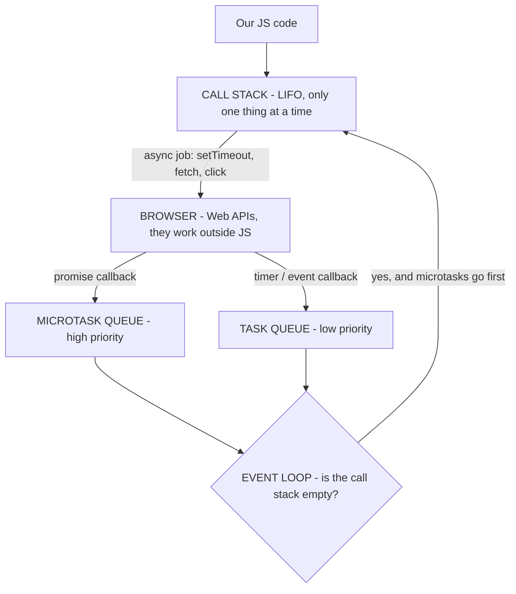
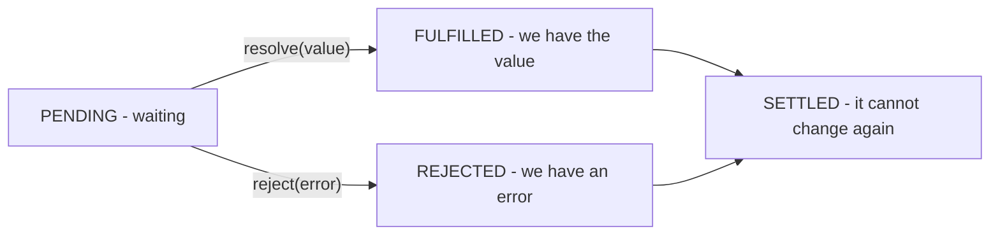

# The Best Notes of the F *Word

> [!warning]- 5 things that were wrong in the original (read this first)
> 1. The call stack is **LIFO**, not FIFO.
> 2. The event loop only moves a task to the call stack **when the call stack is empty**.
> 3. `fetch` callbacks go to the **microtask queue**, not the task queue (they are promises).
> 4. Hooks came in React **16.8**, not React 16.
> 5. `useEffect` runs **after the browser paints**, not just "after render".

## Index

- [[CSS]]
- [[Array Notes]]
- [[Questions for interviews]]
- [[Utils]]
- [[Assessment Questions]]
- [[Mock Interviews Knowledge Base]] — the 4 mock sessions, consolidated as questions

## Call stack

The call stack has the job of executing the code of our JS application.

It is a ***LIFO** (Last In, First Out): the last function that enters is the first one that goes out.

It receives the JS tasks, like a `console.log` or normal JS code. In some cases the event loop sends things to the call stack from the microtask queue and the task queue. The microtask queue has more priority than the task queue.

### Task queue

It is a special queue in JS used to handle callbacks from browser APIs, like `setTimeout`, DOM events (click, scroll) or the geolocation API. When the API is finished, that callback goes to the task queue.

It is also called the *macrotask queue* or *callback queue*.

> [!warning] Correction
> The original note put the **fetch API** here. `fetch` returns a **promise**, so its `.then()` callback goes to the **microtask queue**, not to the task queue. This is a very common interview question.

### Microtask queue

It is a special queue to handle things like promises (`.then`, `.catch`, `.finally`), `async/await` and `queueMicrotask`.

It has **more priority** than the task queue.

### Event loop

It is a piece of the JS mechanism and it has the responsibility to take the tasks from the task queue and the microtask queue and pass them to the call stack.

Two rules that the original note was missing:

1. It only passes a task **when the call stack is empty**.
2. It empties the **whole** microtask queue first, and only then it takes **one** task from the task queue.

```js
console.log("1");                          // call stack, now
setTimeout(() => console.log("2"), 0);     // task queue
Promise.resolve().then(() => console.log("3")); // microtask queue
console.log("4");                          // call stack, now

// Output: 1, 4, 3, 2
```

## Everything together: how JS runs the code

This is the [[#Call stack]], the [[#Task queue]], the [[#Microtask queue]] and the [[#Event loop]] working as **one system**.

The important idea: **JavaScript is single-threaded**. It has only **one** call stack, so it can only do **one thing at a time**. The queues and the event loop are the way the browser lets JS do asynchronous things **without blocking** that single thread.



### The complete cycle

1. JS reads the code line by line and puts every function in the **call stack**.
2. If the function is **synchronous**, it runs, returns, and leaves the stack.
3. If it is **asynchronous** (`setTimeout`, `fetch`, a click listener), JS does **not** wait. It gives the job to the **browser** and continues with the next line. This is why the page does not freeze.
4. When the browser finishes that job, it does **not** put the callback in the call stack directly. It puts it in a **queue**:
	- promise callback → **microtask queue**
	- timer, DOM event, geolocation → **task queue**
5. The **event loop** watches the call stack. When the stack is **empty**:
	- first it runs **all** the microtasks, one by one, until the microtask queue is empty,
	- then it takes **only one** task from the task queue,
	- and it repeats.
6. This is why a promise always runs before a `setTimeout`, even with `0` ms.

### Example step by step

```js
console.log("Start");

setTimeout(() => console.log("Timeout"), 0);

Promise.resolve().then(() => console.log("Promise"));

console.log("End");

// Output: Start, End, Promise, Timeout
```

| # | What happens | Where | Output |
|---|---|---|---|
| 1 | `console.log("Start")` enters, prints, leaves | Call stack | `Start` |
| 2 | `setTimeout` enters, gives the timer to the browser, leaves | Call stack → Browser | |
| 3 | The promise is already resolved, so its callback waits | Microtask queue | |
| 4 | `console.log("End")` enters, prints, leaves | Call stack | `End` |
| 5 | The main code finishes, **the call stack is empty** | — | |
| 6 | Event loop: microtasks **first** | Microtask queue → Call stack | `Promise` |
| 7 | Microtasks empty, now **one** task | Task queue → Call stack | `Timeout` |

> [!tip] Why `0` ms is not really 0
> `setTimeout(fn, 0)` does not mean "run now". It means "put this in the task queue as soon as possible". It still has to wait for the call stack to be empty **and** for all the microtasks to finish.

> [!question] Short answer for the interview
> "JavaScript is single-threaded, it has only one call stack, so it can do one thing at a time. When there is an async operation, the browser handles it outside of JS. When it finishes, the callback goes to a queue: promises go to the microtask queue and timers or DOM events go to the task queue. The event loop checks if the call stack is empty, and if it is, it empties all the microtask queue first and then takes one task from the task queue."

## How do promises work?

A **promise** is an object that represents a value that we do **not** have yet. It is the result of an asynchronous operation that will finish in the future.

### The 3 states



A promise starts as **pending**. When it changes to **fulfilled** or **rejected** we say it is **settled**, and after that it can **never** change again.

### How we create it and how we use it

```js
// create
const myPromise = new Promise((resolve, reject) => {
  const ok = true;
  if (ok) {
    resolve("it worked");   // pending → fulfilled
  } else {
    reject(new Error("it failed"));  // pending → rejected
  }
});

// use it with .then
myPromise
  .then((value) => console.log(value))     // receives the resolve
  .catch((error) => console.log(error))    // receives the reject
  .finally(() => console.log("always runs"));

// use it with async / await (the same, but easier to read)
async function run() {
  try {
    const value = await myPromise;
    console.log(value);
  } catch (error) {
    console.log(error);
  } finally {
    console.log("always runs");
  }
}
```

`async/await` is only **syntactic sugar** over promises. An `async` function **always** returns a promise, and `await` pauses that function until the promise is settled — but it does **not** block the [[#Call stack]], so the rest of the app keeps working.

> [!info] Connection with the event loop
> The `.then()` callbacks do not run immediately. They go to the [[#Microtask queue]], and the [[#Event loop]] runs them when the call stack is empty. This is why a promise always runs before a `setTimeout`.

### Chaining

Each `.then()` returns a **new** promise, so we can chain them. This is what solves the old *callback hell*.

```js
fetch("/api/user")
  .then((res) => res.json())      // we return a value → it goes to the next .then
  .then((user) => console.log(user.name))
  .catch((error) => console.log(error));  // catches the error of ANY step above
```

> [!warning] Very common mistake
> If we forget the `return` inside a `.then()`, the next `.then()` receives `undefined`.

### The 4 combinators

| Method                      | It fulfills when                               | It rejects when                           |
| --------------------------- | ---------------------------------------------- | ----------------------------------------- |
| `Promise.all([...])`        | **all** of them fulfill                        | the **first** one that rejects            |
| `Promise.allSettled([...])` | **all** of them finish (ok or error)           | **never**                                 |
| `Promise.race([...])`       | the **first** one that settles, if it fulfills | the first one that settles, if it rejects |
| `Promise.any([...])`        | the **first** one that fulfills                | **all** of them reject                    |

```js
// all: we need the 3 results, if one fails we lose everything
const [user, posts, comments] = await Promise.all([
  fetch("/user"), fetch("/posts"), fetch("/comments")
]);

// allSettled: we want to know what happened with each one
const results = await Promise.allSettled([...]);
// [{ status: "fulfilled", value: ... }, { status: "rejected", reason: ... }]
```

> [!question] Short answer for the interview
> "A promise is an object that represents the result of an async operation that is not ready yet. It has 3 states: pending, fulfilled and rejected, and when it settles it cannot change again. We consume it with `.then/.catch/.finally` or with `async/await`, which is sugar over the same thing. Its callbacks go to the microtask queue, so they have priority over `setTimeout`."

## Debounce vs throttle

Both are techniques to **control how many times a function runs** when an event fires a lot of times: typing, scroll, resize, mousemove. Without them we can run a function hundreds of times in a few seconds and kill the performance.

The difference is **when** they let the function run.

| | Debounce | Throttle |
|---|---|---|
| Idea | Wait until the user **stops** | Run maximum **once every X ms** |
| The timer | **Resets** on every call | Does **not** reset |
| If the event never stops | It **never** runs | It keeps running, regular |
| Analogy | The elevator door: it waits for the last person | The bus: it leaves every 10 min, full or empty |
| Use it for | Search input, autosave, validate a form | Scroll, resize, mousemove, drag, infinite scroll |

```js
// DEBOUNCE: it only runs when X ms pass WITHOUT calls
function debounce(fn, delay) {
  let timer;
  return (...args) => {
    clearTimeout(timer);              // cancel the previous one
    timer = setTimeout(() => fn(...args), delay);
  };
}

// THROTTLE: it runs, and then it ignores everything for X ms
function throttle(fn, limit) {
  let waiting = false;
  return (...args) => {
    if (waiting) return;              // we are inside the window, ignore
    fn(...args);
    waiting = true;
    setTimeout(() => { waiting = false; }, limit);
  };
}
```

If the user types `hello` fast (5 letters in 1 second) with `300 ms`:

- **Debounce** → the function runs **1 time**, 300 ms after the last letter.
- **Throttle** → the function runs **around 3 times**, spread during that second.

> [!tip] How to choose
> Do I only care about the **final** result? → **debounce**.
> Do I need updates **while** it is happening? → **throttle**.

> [!question] Short answer for the interview
> "Both limit how many times a function runs. Debounce waits until the events stop and then runs once — good for a search input. Throttle runs at a regular rate, maximum once every X milliseconds, and ignores the calls in the middle — good for scroll or resize."

## `window` vs `global`

Both are the **global object**, but in **different environments**. It is the object where the global variables and the functions of the environment live.

| | `window` | `global` | `globalThis` |
|---|---|---|---|
| Environment | Browser | Node.js | **Both** |
| Since | Always | Always | ES2020 |
| It has | `document`, `localStorage`, `location`, `alert`, `innerWidth` | `process`, `Buffer` | what the environment has |

```js
// Browser
window.localStorage;   // ✅
window.process;        // ❌ undefined

// Node
global.process.env;    // ✅
global.document;       // ❌ undefined

// Both (the modern and safe way)
globalThis.setTimeout; // ✅ in the browser and in Node
```

> [!tip] Use `globalThis`
> If we write code that has to work in the browser **and** in Node (SSR with Next.js, a library, tests with Jest), `globalThis` is the correct way. It avoids the classic error `window is not defined` on the server.

### Two details that they ask in interviews

**1. `var` creates a property on `window`, `let` and `const` do not.**

```js
// in the browser, at the top level
var a = 1;
let b = 2;
console.log(window.a);  // 1
console.log(window.b);  // undefined
```

**2. In Node, the top level of a file is NOT global.** Every file is a module with its own scope, so a `var` there stays inside the file. In the browser, a normal `<script>` shares the same global scope with the other scripts — this is why we can have name collisions.

> [!question] Short answer for the interview
> "They are the same concept, the global object, but `window` is the one in the browser and `global` is the one in Node. `window` has the browser APIs like `document` or `localStorage`, which do not exist in Node. Today the best option is `globalThis`, because it works in both environments."

## Pros and cons of JS vs TS

TypeScript is a **superset** of JavaScript: it is JS plus **static types**. It does not run in the browser — it **compiles** to plain JS, and in that step all the types **disappear**.

```ts
// TypeScript
function sum(a: number, b: number): number {
  return a + b;
}
sum(1, "2");  // ❌ Error BEFORE running it

// The compiled JS (the types are gone)
function sum(a, b) {
  return a + b;
}
```

| | TypeScript | JavaScript |
|---|---|---|
| **Pros** | We see the errors **before** running (compile time) | No build step, it runs directly |
| | Much better autocomplete in the editor | Faster to start, less setup |
| | Safe refactors in big projects | More flexible and quicker for small things |
| | The types work as documentation | Everybody knows it |
| | Better for big teams | Perfect for prototypes and small scripts |
| **Cons** | Learning curve | The errors only appear at **runtime** |
| | More setup and a compilation step | Refactoring is risky |
| | We write more code | Poor autocomplete |
| | Some libraries need `@types/...` | Hard to maintain when the project grows |

> [!danger] The most important trap
> The types **do not exist at runtime**. TypeScript does **not** validate the data that comes from an API.
> ```ts
> const user: User = await res.json();  // TS trusts us... but the API can return anything
> ```
> If the backend changes, TS does not notice and the app breaks. For external data we need real validation at runtime (for example with **Zod**).

> [!tip] When to use each one
> **TypeScript** → medium or big projects, teams, code that will live for years, libraries.
> **JavaScript** → small scripts, quick prototypes, learning, something we will throw away.

> [!question] Short answer for the interview
> "TypeScript is JavaScript plus static types. The main advantage is that we catch the errors at compile time instead of in production, and the autocomplete and the refactors are much better, which matters a lot in big projects and teams. The cost is the learning curve, the setup and the build step. And something important: the types are erased when it compiles, so TS does not validate the data of an API at runtime — for that we still need something like Zod."

## Which methods replace useEffect

### Mounting phase (component creation)

- **Class component** → `componentDidMount()`
- **Function component** → `useEffect(() => { ... }, [])`

Empty dependency array = run once after the initial render.

### Updating phase (when props/state change)

- **Class component** → `componentDidUpdate(prevProps, prevState)`
- **Function component** → `useEffect(() => { ... }, [dependencies])`

Runs whenever the listed dependencies change.

### Unmounting phase (cleanup)

- **Class component** → `componentWillUnmount()`
- **Function component** → `useEffect(() => { return () => { ... } }, [])`

The cleanup function inside the effect runs before the component unmounts.

### The lifecycle methods that `useEffect` does **not** replace

> [!warning] The follow-up after the three phases above
> The three phases map cleanly, so the panel goes one step further: **"and the rest?"**. Not every lifecycle method has a hook.

| Class method | Hook equivalent | The real answer |
|---|---|---|
| `shouldComponentUpdate` | **none** | The closest thing is `React.memo`, and it wraps the component **from the outside** |
| `PureComponent` | **none** | `React.memo` — but it compares **props only**, not state |
| `getDerivedStateFromError` / `componentDidCatch` | **none** | An **error boundary can only be a class component**, still today |
| `getDerivedStateFromProps` | **none** | Derive the value **during the render**, or reset with a `key` |
| `forceUpdate()` | **none** | `useReducer(x => x + 1, 0)` as an escape hatch |

**`shouldComponentUpdate(nextProps, nextState, nextContext)`** is the class bailout: returning `false` skips `render()` **and the whole subtree**. It is **not** called on mount and **not** called after `forceUpdate()`. It is **not deprecated** — the deprecated ones are `componentWillMount`, `componentWillReceiveProps` and `componentWillUpdate` (the `UNSAFE_` ones).

> [!danger] The inverted return value — this is the trap
> | API | `true` means |
> |---|---|
> | `shouldComponentUpdate` | **render** |
> | `React.memo`'s second argument `areEqual` | **props are equal → skip the render** |
>
> Same word, opposite outcome. Getting it backwards silently freezes the UI.

> [!tip] Why there is no hook for `shouldComponentUpdate`
> `React.PureComponent` can shallow-compare **props *and* state**, because in a class the state is one object (`this.state`). `React.memo` compares **props only**: hook state is not a single object it can inspect. That is the mechanical reason why `React.memo` **never** blocks a re-render caused by the component's own `useState` — it only intercepts renders coming from the parent.
> Full detail in [[React Re-renders and Memoisation]].

> [!warning] Error boundaries — the row that cost points before
> There is no hook for `getDerivedStateFromError` / `componentDidCatch`: a boundary **must** be a class (or the `react-error-boundary` package, which is a class underneath). And they catch **render-time errors only** — not async code, not promise rejections, not event handlers. Same row as in [[Mock Interviews Knowledge Base#🔁 The vocabulary drill — the highest value table in this note]].

## Hooks

Hooks were introduced in **React 16.8** and have 2 main purposes:

1. **Code reusability**: we can create custom hooks to encapsulate reusable pieces of code.
2. They are special functions in React that let us use **state and other React features inside function components**, without writing a class.

> [!warning] Correction
> The original said "React 16". Hooks arrived in **16.8** (February 2019). Also the second point was cut in the middle, so here it is complete.

## useEffect vs useLayoutEffect

**useEffect** runs *after* the browser paints the component on the screen. It is asynchronous, so it does not block the paint.

**useLayoutEffect** runs after React applies the changes to the DOM, but *before* the browser paints on the screen. It is synchronous, so it blocks the paint.

useLayoutEffect is mostly used to make measurements and, based on that, make micro adjustments in very specific components like tooltips, popovers and modals.

> [!tip] Easy rule
> If the user can see a "jump" on the screen, use `useLayoutEffect`. For everything else, use `useEffect`.


# Ataques XSS (Cross-Site Scripting)

Attacks XSS occur when an attacker injects JavaScript into our pages 
using attack vectors such as input fields, URL parameters, and redirects. 

## Ways to Protect Ourselves

* **Sanitize Data:** Before processing any data, convert it to a string 
  or use a library like `xss` or `DOMPurify` to process the data before 
  using it.
* **Server-Side Validation:** Validate all values on the server to ensure 
  we don't have malicious JavaScript in the payloads.
* **Content Security Policy (CSP):** It's a meta tag that tells the 
  browser which scripts our page will execute. If an external script 
  arrives at our page, it will be ignored.
* **HTTP-Only Cookies:** Prevents JavaScript from reading our sensitive 
  cookies.

**Note:** Modern frameworks like React, Vue, and Angular are generally 
protected against this type of attack because they sanitize data 
automatically.

# Ataques CSRF (Cross-Site Request Forgery)

Attacks CSRF occur when an attacker forces an authenticated user to perform unauthorized actions on another website where they are logged in, without the user's knowledge or consent. The attacker creates a malicious request using techniques like hidden forms, links, or JavaScript on their own site, which automatically sends the user's cookies to the target website, making it appear as if the user made the request.

## Ways to Protect Ourselves

- **CSRF Tokens**: Generate a unique token for each form or API request on the server side. Include this token in the form or request header. Validate that the token matches on the server before processing the action. An attacker cannot generate a valid token, so their requests will be rejected.
- **SameSite Cookie Flag**: Set the `SameSite` attribute on cookies (Strict, Lax, or None) to control whether cookies are sent when requests come from other websites. `SameSite: Strict` prevents cookies from being sent to cross-site requests, blocking most CSRF attacks.
- **Validate Origin and Referer Headers**: Check the `Origin` and `Referer` HTTP headers to ensure the request comes from your own website. Reject requests that come from unknown or untrusted origins.
- **Use HTTPS and Secure Cookies**: Implement HTTPS for all communications and set the `secure` flag on cookies so they are only transmitted over encrypted connections.

			Note: Modern frameworks like Express.js with `csurf` middleware, Django with CSRF protection, and Laravel with CSRF tokens have built-in protection against CSRF attacks. Frontend frameworks like React and Vue do not automatically protect against CSRF, but they work well with backend CSRF token implementations.
## Still to study

> [!todo]- Topics without a definition yet
> These were only a list in the original note. I kept them and only fixed the spelling.

> [!success]- JavaScript / TypeScript — done ✅
> - [x] [[#How do promises work?]]
> - [x] [[#Pros and cons of JS vs TS]]
> - [x] [[#Debounce vs throttle]]
> - [x] [[#`window` vs `global`]]

### React

- [ ] Steps to improve the performance of a React app
- [ ] Virtualization in React
- [ ] Asynchronous rendering
- [ ] React composition
- [ ] Why do we need state management?

> [!success]- Design patterns — done ✅ in [[Design Patterns]]
> - [x] [[Design Patterns#Strategy]]
> - [x] [[Design Patterns#Observer]]
> - [x] [[Design Patterns#Pub-sub]]
> - [x] [[Design Patterns#Functional patterns]]
> - [x] [[Design Patterns#Anti-patterns]]
>
> The note also adds the other categories (factory, singleton, builder, facade, adapter, proxy, command) with examples verified in Node.

### Principles

- [x] DRY — [[Design Patterns#DRY, YAGNI, KISS]]
- [x] YAGNI — [[Design Patterns#DRY, YAGNI, KISS]]
- [x] KISS — [[Design Patterns#DRY, YAGNI, KISS]]
- [x] SOLID — [[Design Patterns#SOLID]]
- [x] Dependency injection vs inversion of control — [[Design Patterns#Dependency inversion vs dependency injection vs inversion of control]]
- [ ] Functional and non-functional requirements — the non-functional part is in [[Assessment Questions#What are non-functional requirements? Name some]], the functional part is still missing
- [x] Create rules in the linter to keep the code readable and maintainable: limit the line size and the number of parameters, and keep the conventions of the project — [[Design Patterns#DRY, YAGNI, KISS]]

### Security

- [ ] Service worker
- [ ] `npm audit`
- [ ] How to manage sensitive data

### Work methodologies

- [ ] Waterfall
- [ ] Agile
- [ ] Kanban
- [ ] Types of tests: unit test, integration test, regression test, end-to-end test
- [ ] Continuous integration
- [ ] Continuous delivery
- [ ] Continuous deployment

---

### From the Level Up career plan (Senior Software Engineer)

> [!warning]- Why these are here even when the page says "Done"
> The page marks 29 of these as **Developed skill**, but that is only the status of the plan. A topic is only studied when it is written in this vault. These are the technical skills of the plan that are **not** in these notes yet.
> The soft skills and the process ones are in [[Soft Skills and Processes to study]].
> Only the subtopics that are missing are listed. What is already in [[Assessment Questions]] or in these notes was removed.

### HTML
https://levelup.epam.com/skill/skillId=7770000000000102564&skillLevelId=7770000000000001003&externalUserId=8760000000007062455&planId=0f1fde13-8c31-464f-b6d4-a40d1aee42df
Resumen: the markup language of the web, at Advanced level.
Topics clave a dominar:
- HTML 5 input types
- Semantic elements, and why they matter
- Include internal and external scripts, and where to put them
- Inline, internal and external CSS

### CSS
https://levelup.epam.com/skill/skillId=7770000000000101404&skillLevelId=7770000000000001003&externalUserId=8760000000007062455&planId=0f1fde13-8c31-464f-b6d4-a40d1aee42df
Resumen: the style language, at Advanced level — the notes only cover [[Flex]] and [[Grid]].
Topics clave a dominar:
- Stacking contexts and `z-index` (a classic interview question)
- Positioning (`static`, `relative`, `absolute`, `fixed`, `sticky`)
- Overflow control
- CSS custom properties (variables) and theming
- Maintainable style architecture: naming conventions, modular files, reusable patterns
- The cascade and specificity, to resolve rules in conflict

### JavaScript
https://levelup.epam.com/skill/skillId=339&skillLevelId=7770000000000001003&externalUserId=8760000000007062455&planId=0f1fde13-8c31-464f-b6d4-a40d1aee42df
Resumen: the language at Advanced level — the event loop, the promises and the prototype are already done.
Topics clave a dominar:
- ES modules (`import` / `export`, static vs dynamic import, tree shaking)
- Execution context and the scope chain
- Consistent error handling in asynchronous flows
- Object patterns and composition
- How to write unit tests and refactor for readability and reuse

### TypeScript
https://levelup.epam.com/skill/skillId=7770000000000112280&skillLevelId=7770000000000001003&externalUserId=8760000000007062455&planId=0f1fde13-8c31-464f-b6d4-a40d1aee42df
Resumen: TS at Advanced level — the notes only have the pros and cons, not the type system.
Topics clave a dominar:
- Nominal vs structural typing, and the `never` type
- Tuples, records, `as const`, named tuples
- Type manipulation: `Readonly`, conditional types, `infer`
- Utility types: `ThisType`, `ThisParameterType`, `OmitThisParameter`, `InstanceType`
- Type narrowing: assert functions, `as` casting vs `satisfies`
- Decorators (how they work, TS decorators vs esNext decorators, pitfalls)
- `tsconfig`: `module`, `moduleResolution`, `isolatedModules`, multiple configs
- Declaration merging, and how to extend global or third party typings

### JavaScript in Browser
https://levelup.epam.com/skill/skillId=7770000000000116741&skillLevelId=7770000000000001003&externalUserId=8760000000007062455&planId=0f1fde13-8c31-464f-b6d4-a40d1aee42df
Resumen: how to write and organize the JS that runs in the browser.
Topics clave a dominar:
- Client-side state with browser storage (`localStorage`, `sessionStorage`, IndexedDB)
- The History API
- Clipboard API and Geolocation API
- Organize browser code in modules and reusable functions
- Optimize the rendering and the interaction performance

### Browser APIs
https://levelup.epam.com/skill/skillId=7770000000000102876&skillLevelId=7770000000000001003&externalUserId=8760000000007062455&planId=0f1fde13-8c31-464f-b6d4-a40d1aee42df
Resumen: the APIs that the browser gives to JS — the notes only define what the DOM is.
Topics clave a dominar:
- DOM API, BOM (Browser Object Model) and CSSOM — the three are different
- Feature detection and compatibility fallbacks between engines
- Media APIs and device APIs, with permission handling and error recovery
- Memory usage in event-driven interactions

### JavaScript Development Tools
https://levelup.epam.com/skill/skillId=7770000000000102295&skillLevelId=7770000000000001003&externalUserId=8760000000007062455&planId=0f1fde13-8c31-464f-b6d4-a40d1aee42df
Resumen: the toolchain of a JS project.
Topics clave a dominar:
- Transpilation and bundling, configured per environment
- Difference between a transpiler (Babel, swc) and a bundler (Webpack, Vite, Rollup, esbuild)
- Debugging across the browser, the runtime and the build layers
- Automate linting, formatting and the execution of the tests

### JavaScript Top Frameworks
https://levelup.epam.com/skill/skillId=7770000000000117080&skillLevelId=7770000000000001003&externalUserId=8760000000007062455&planId=0f1fde13-8c31-464f-b6d4-a40d1aee42df
Resumen: what is expected from a person that is Advanced in one framework and knows the others.
Topics clave a dominar:
- Compound components (composition pattern that is missing in the notes)
- Design systems and component libraries
- Routing strategies: dynamic imports and code splitting by route
- Internationalization (i18n) and multi-language support
- Micro-frontend architectures
- Pros and cons of a second framework of the stack

### ReactJS
https://levelup.epam.com/skill/skillId=7770000000000102668&skillLevelId=7770000000000001003&externalUserId=8760000000007062455&planId=0f1fde13-8c31-464f-b6d4-a40d1aee42df
Resumen: React at Advanced level — the reuse patterns, the security and the SSR are already in [[Assessment Questions]].
Topics clave a dominar:
- Virtual DOM in depth: the **reconciliation algorithm**, recursing on children, the role of the **keys**
- **Fiber architecture**
- Automated testing: React Testing Library or Enzyme, and e2e with Playwright, Cypress or Puppeteer
- Types of rendering in the tests
- Building: transpilers, bundlers, dev vs production build, code splitting, build optimization
- Static site rendering with Gatsby (Next.js is already in the notes)

### Angular
https://levelup.epam.com/skill/skillId=4060741400037627506&skillLevelId=7770000000000001003&externalUserId=8760000000007062455&planId=0f1fde13-8c31-464f-b6d4-a40d1aee42df
Resumen: the plan asks Advanced and the self-declared level is Intermediate — it is the biggest technical gap.
Topics clave a dominar:
- Components and NgModules: standalone components, bootstrap without NgModule, `APP_INITIALIZER`
- Component interaction: `ViewChild`/`ContentChild`, multi-content projection, **Signals**
- Lifecycle hooks: `DoCheck`, `AfterContentChecked`, `afterRender`, `afterNextRender`, `DestroyRef`
- Directives, embedded views, `ngTemplateOutlet`, the built-in control flow
- **Change detection**: `tick()`, `runOutsideAngular`, `ExpressionChangedAfterItHasBeenChecked`, why `| async` works with `OnPush`, zone-less
- Dependency injection: `viewProviders`, `@Self`/`@SkipSelf`/`@Optional`, `multi: true`, `forwardRef`
- RxJS: schedulers, multicasting, `share`, `expand`, custom operators, `takeUntilDestroyed`
- Forms: custom validation, `ControlValueAccessor`, typed forms
- HTTP: order of the interceptors, expired token, http context
- Routing: `RouteReuseStrategy`, `PreloadingStrategy`, functional vs class guards
- Unit testing: `HttpTestingController`, `ComponentHarness`
- SSR with Angular Universal, and service / web workers

### VueJS
https://levelup.epam.com/skill/skillId=7770000000000108984&skillLevelId=7770000000000001003&externalUserId=8760000000007062455&planId=0f1fde13-8c31-464f-b6d4-a40d1aee42df
Resumen: the plan asks Advanced and the self-declared level is Novice.
Topics clave a dominar:
- Rendering mechanism: virtual DOM, templates vs render functions
- Reactivity in depth (this is the question they always ask about Vue)
- Performance: `v-show`, `keep-alive`, dynamic and async components, functional components, memory leaks
- SSR with `vue-server-renderer`, Nuxt and static site generation
- Testing with Jest and Vue Test Utils

### Web Application Rendering Strategies
https://levelup.epam.com/skill/skillId=7770000000002777791&skillLevelId=7770000000000001002&externalUserId=8760000000007062455&planId=0f1fde13-8c31-464f-b6d4-a40d1aee42df
Resumen: all the ways to render a web app — the notes only cover SSR.
Topics clave a dominar:
- SSG (static site generation) and **ISG** (incremental static generation)
- **Streaming SSR** and Render-as-You-Fetch
- Isomorphic / universal rendering
- Server-side caching (Redis, Memcached) and the role of a **CDN**
- Lazy loading and caching strategies
- Bundlers: Webpack, Rollup, Parcel

### CSS Preprocessors
https://levelup.epam.com/skill/skillId=7770000000000107664&skillLevelId=7770000000000001003&externalUserId=8760000000007062455&planId=0f1fde13-8c31-464f-b6d4-a40d1aee42df
Resumen: SASS, LESS, PostCSS and how to organize the styles with them.
Topics clave a dominar:
- SASS/SCSS, LESS, PostCSS, Stylus — and what each one gives
- Mixins, functions and reusable utility patterns
- Scalable stylesheet architecture with partials
- Integration with the build tools, the linting and the asset pipeline
- Tradeoffs of maintainability in a big codebase

### CSS Methodologies
https://levelup.epam.com/skill/skillId=7770000000000102624&skillLevelId=7770000000000001003&externalUserId=8760000000007062455&planId=0f1fde13-8c31-464f-b6d4-a40d1aee42df
Resumen: the systems to write CSS that scales.
Topics clave a dominar:
- **BEM** (the most asked one), OOCSS, SMACSS, ITCSS, Atomic CSS
- Be able to **compare** them, not only to define them
- CSS-in-JS and CSS Modules, and when each one makes sense

### CSS Frameworks
https://levelup.epam.com/skill/skillId=7770000000000107505&skillLevelId=7770000000000001003&externalUserId=8760000000007062455&planId=0f1fde13-8c31-464f-b6d4-a40d1aee42df
Resumen: Bootstrap, Tailwind and company, at Advanced level.
Topics clave a dominar:
- Utility-first (Tailwind) vs component-based (Bootstrap) — the tradeoffs
- Theming mechanisms and asset loading strategies
- Maintainable overrides that respect the conventions of the framework
- Optimize the framework for performance and accessibility

### Cross-browser compatible HTML/CSS markup
https://levelup.epam.com/skill/skillId=7770000000000102410&skillLevelId=7770000000000001003&externalUserId=8760000000007062455&planId=0f1fde13-8c31-464f-b6d4-a40d1aee42df
Resumen: markup that works the same in every browser.
Topics clave a dominar:
- **Progressive enhancement** and graceful degradation
- Feature detection and fallback patterns
- Diagnose rendering defects between engines
- Evaluate the impact of the browser support when we use a new HTML or CSS feature

### Web Communication Protocols
https://levelup.epam.com/skill/skillId=7770000000000116742&skillLevelId=7770000000000001002&externalUserId=8760000000007062455&planId=0f1fde13-8c31-464f-b6d4-a40d1aee42df
Resumen: how the browser talks with the server — the notes only have `fetch` and the cookies.
Topics clave a dominar:
- **HTTP/2** and what it changed (multiplexing)
- **WebSockets**, **Server-Sent Events** and long-polling — when to use each one
- **GraphQL** vs REST
- Structure of a request and a response: methods, status codes, headers
- Cookies, sessions and tokens for a stateful interaction
- TLS and validation of the certificate

### Web Performance Analysis and Optimization
https://levelup.epam.com/skill/skillId=7770000000000106635&skillLevelId=7770000000000001002&externalUserId=8760000000007062455&planId=0f1fde13-8c31-464f-b6d4-a40d1aee42df
Resumen: measure and improve the performance — the process for React is already in [[Assessment Questions]].
Topics clave a dominar:
- **Critical Rendering Path**
- **Repaint and reflow**, and what triggers them
- **Core Web Vitals**: FCP, LCP, CLS, INP — know how to measure them
- Lighthouse and PageSpeed Insights
- Caching in the browser and in the server
- Images: viewport, sizing, aspect ratio, caching
- Minification and obfuscation

### Frontend Web Accessibility
https://levelup.epam.com/skill/skillId=7770000000000103654&skillLevelId=7770000000000001002&externalUserId=8760000000007062455&planId=0f1fde13-8c31-464f-b6d4-a40d1aee42df
Resumen: the notes admit this is the weakest area of the project — here it is a requirement.
Topics clave a dominar:
- **WCAG 2.x** and Section 508
- ARIA roles, landmarks and the WAI-ARIA Authoring Practices
- Accessible HTML: semantic elements used correctly
- Accessible forms: labels, error handling, validation
- Focus management, and device-dependent vs device-independent event handlers
- Colour contrast and typography guidelines
- Manual audit with a screen reader

### Content Management Systems
https://levelup.epam.com/skill/skillId=665&skillLevelId=7770000000000001002&externalUserId=8760000000007062455&planId=0f1fde13-8c31-464f-b6d4-a40d1aee42df
Resumen: how a CMS works and how we integrate a front end with it.
Topics clave a dominar:
- Principles of a CMS, and headless CMS vs traditional CMS
- Page layouts and templates
- Multi-language content and localization
- Metadata and SEO
- WYSIWYG components

### PWA & AMP
https://levelup.epam.com/skill/skillId=7770000000000112548&skillLevelId=7770000000000001003&externalUserId=8760000000007062455&planId=0f1fde13-8c31-464f-b6d4-a40d1aee42df
Resumen: progressive web apps — connects with the service worker that is already in the list above.
Topics clave a dominar:
- What makes an app a **PWA**, and the installability
- The **web manifest**
- Offline strategies with the service worker (cache first, network first)
- AMP (Accelerated Mobile Pages)

### Node.js
https://levelup.epam.com/skill/skillId=7770000000000109487&skillLevelId=7770000000000001002&externalUserId=8760000000007062455&planId=0f1fde13-8c31-464f-b6d4-a40d1aee42df
Resumen: the biggest list of the plan — the notes only have the phases of the event loop.
Topics clave a dominar:
- **Streams** and **buffers** (the most asked Node topic after the event loop)
- `EventEmitter` and event-driven programming
- Core APIs: `fs`, `crypto`, `cluster`, `net`, `os`, `zlib`, `readline`
- Error handling: async errors, promise rejections, custom `Error` classes
- Authorization: **JWT**, PassportJS
- Testing: unit, integration, contract, TDD/BDD
- Loggers (Winston, Logstash) and logging levels
- Queues: RabbitMQ, Kafka, SQS, SNS
- Containerization: Docker and Docker Compose
- Serverless: AWS Lambda, Azure Functions
- Microservices basics and application structure

### Node.js Core
https://levelup.epam.com/skill/skillId=7770000000000107813&skillLevelId=7770000000000001002&externalUserId=8760000000007062455&planId=0f1fde13-8c31-464f-b6d4-a40d1aee42df
Resumen: the core modules of Node, without frameworks.
Topics clave a dominar:
- Read and write files asynchronously (callbacks, promises, `fs`)
- Process lifecycle: exit codes, `stdin`, `stdout`, `stderr`, environment variables
- Timers, buffers, streams and events
- Core modules vs installed packages, and `package.json` scripts

### Web Application Hosting
https://levelup.epam.com/skill/skillId=7770000000002777792&skillLevelId=7770000000000001001&externalUserId=8760000000007062455&planId=0f1fde13-8c31-464f-b6d4-a40d1aee42df
Resumen: where the application lives — only Novice level is required.
Topics clave a dominar:
- Shared hosting vs VPS
- Web servers: Nginx, Apache, IIS
- SSL/TLS certificates and why they matter (careful: this is **not** SSR)
- Domain registration and management
- Deploy a simple application

### JavaScript Cross-Mobile Platform
https://levelup.epam.com/skill/skillId=7770000000000112158&skillLevelId=7770000000000001002&externalUserId=8760000000007062455&planId=0f1fde13-8c31-464f-b6d4-a40d1aee42df
Resumen: mobile applications written with JavaScript.
Topics clave a dominar:
- **React Native**, Ionic, Cordova/Capacitor — and the difference between them
- Native look and feel from JavaScript
- Device features: geolocation, camera, accelerometer
- Mobile architecture and integration with REST back ends
- Publishing to the Android and iOS stores
- Performance optimization on mobile

### Common security knowledge
https://levelup.epam.com/skill/skillId=4060741400051296593&skillLevelId=7770000000000001002&externalUserId=8760000000007062455&planId=0f1fde13-8c31-464f-b6d4-a40d1aee42df
Resumen: security beyond XSS — the notes only cover XSS, OWASP and the tokens.
Topics clave a dominar:
- **CSRF** and how we protect against it (tokens, SameSite)
- **SSRF**, injection, directory traversal, log ingestion
- Authentication and authorization: basic, **JWT**, **OAuth** — and the difference between the two words
- Hashing vs encryption, symmetric vs asymmetric cryptography
- Secure coding practices and secure architectural components

### Cloud Fundamentals
https://levelup.epam.com/skill/skillId=7770000000000142963&skillLevelId=7770000000000001001&externalUserId=8760000000007062455&planId=0f1fde13-8c31-464f-b6d4-a40d1aee42df
Resumen: the base of the cloud — only Novice level is required.
Topics clave a dominar:
- **IaaS, PaaS, SaaS** — the service models
- The **shared responsibility model**
- Serverless vs serverfull, and Infrastructure as Code
- Compute: VMs, containers, scalability
- Storage: object, block and file
- Consumption-based pricing

### Software Engineering Knowledge & Experience
https://levelup.epam.com/skill/skillId=7770000000000142962&skillLevelId=7770000000000001003&externalUserId=8760000000007062455&planId=0f1fde13-8c31-464f-b6d4-a40d1aee42df
Resumen: the computer science base that they expect at Advanced level.
Topics clave a dominar:
- Advanced data structures, and the algorithms that go with them
- **Deployment strategies: Canary and Blue-Green** — and when to choose each one
- Virtualization vs containerization: types, solutions, pros and cons
- Profile an application
- Optimize SQL queries
- Software licences: decide if we can use a library in a given context

### Software Design
https://levelup.epam.com/skill/skillId=7770000000000142971&skillLevelId=7770000000000001003&externalUserId=8760000000007062455&planId=0f1fde13-8c31-464f-b6d4-a40d1aee42df
Resumen: architecture at Advanced level — the GoF patterns and SOLID are already in the list above.
Topics clave a dominar:
- **Event-driven architecture**
- **Micro-frontends**
- Integration patterns, messaging patterns and enterprise application patterns
- Compare the paradigms **OOP vs FP vs RP** (reactive) with pros and cons
- Architectural styles and tactics to reach the quality attributes
- **Cross-cutting concerns** and how to solve them for a whole solution
- Technical documentation: coding standards and engineering diagrams

### Software Engineering Practices
https://levelup.epam.com/skill/skillId=7770000000000111460&skillLevelId=7770000000000001003&externalUserId=8760000000007062455&planId=0f1fde13-8c31-464f-b6d4-a40d1aee42df
Resumen: the plan asks Advanced and the self-declared level is Intermediate — CI/CD is already in the list above.
Topics clave a dominar:
- **Branching strategies**: Git Flow, trunk-based development, GitHub Flow
- Advanced Git: hooks, tags, pruning local and remote branches
- Design a CI/CD process and find its **bottlenecks**
- Performance testing according to the objectives
- Establish code quality practices in a project
- Organize the knowledge sharing of all of this

### Gen AI Assisted Development
https://levelup.epam.com/skill/skillId=7770000000002743659&skillLevelId=7770000000000001002&externalUserId=8760000000007062455&planId=0f1fde13-8c31-464f-b6d4-a40d1aee42df
Resumen: working with AI agents — a new skill of the plan, and nothing about it is in the notes.
Topics clave a dominar:
- AI coding assistants: GitHub Copilot, Cursor, Claude Code
- Plan / Think mode to decompose a complex task before the agent executes it
- Instruction files: `CLAUDE.md`, `.cursorrules`, `copilot-instructions.md`
- **MCP** (Model Context Protocol) to integrate external systems
- Principles of the agentic workflow: planning, tool use, execution, observation, self-correction
- How the context of the agent affects the quality of the output
- How the agent works with the filesystem and the terminal: permissions and approval


